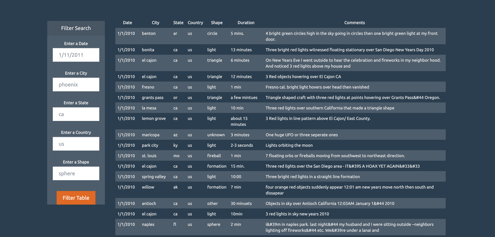

# UFO Analysis
https://hanyang2019.github.io/UFO_Analysis/
## Background
Use JavaScript, HTML, CSS, and D3.js to build a web page that dynamically displays a table of based on users’ input.
## Objectives
* Create a basic HTML web page.
* Using the [UFO dataset](static/js/data.js) provided in the form of an array of JavaScript objects, write code that appends a table to the web page and then adds new rows of data for each UFO sighting.
* Columns of the table include `date/time`, `city`, `state`, `country`, `shape`, and `comment`.
* Using multiple `input` tags and/or select dropdowns, write JavaScript code so the user can to set multiple filters and search for UFO sightings using the following criteria based on the table columns:
   * `date/time`
   * `city`
   * `state`
   * `country`
   * `shape`
## Preview

